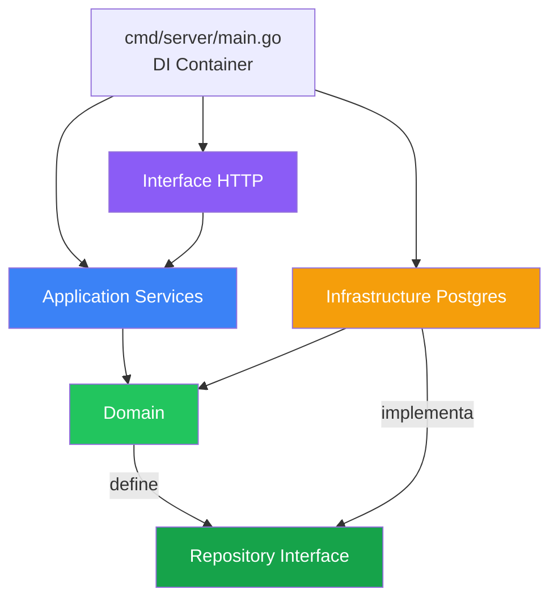
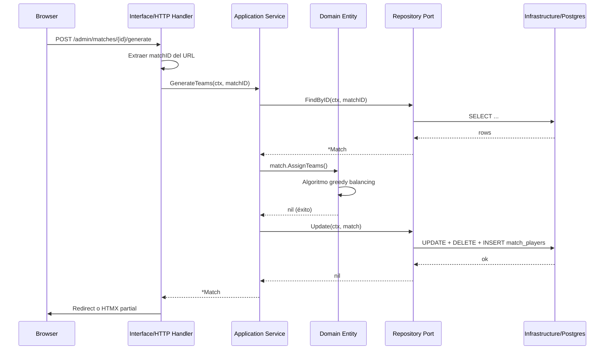

# Arquitectura — Futbol App

## Visión general

**Futbol App** sigue el patrón de **Clean Architecture** (también llamada Hexagonal o Ports & Adapters) dentro de un **Monolito Modular**.

### Principio fundamental

> Las flechas de dependencia siempre apuntan hacia adentro.
> El dominio no sabe que existe Postgres, ni HTTP, ni ningún framework.

```
┌──────────────────────────────────────────────────────────┐
│                   Interface (HTTP)                        │
│           Handlers, Router, Middleware, Templates         │
├──────────────────────────────────────────────────────────┤
│                 Application (Use Cases)                   │
│          PlayerService, MatchService, UserService         │
├──────────────────────────────────────────────────────────┤
│                    Domain (Core)                          │
│           Player, Match, User + Repository ports          │
├──────────────────────────────────────────────────────────┤
│               Infrastructure (Adapters)                   │
│          PostgresPlayerRepo, PostgresMatchRepo            │
└──────────────────────────────────────────────────────────┘
         ↑ Las capas internas NO conocen las externas
```

---

## Capas y responsabilidades

### Domain
- Entidades puras: `Player`, `Match`, `User`
- Reglas de negocio (validaciones, invariantes)
- Interfaces de repositorio (puertos)
- **Cero dependencias externas** — solo Go estándar

### Application
- Casos de uso: orquesta el dominio y los puertos
- DTOs (Input/Output objects)
- No contiene lógica de negocio propia
- Depende solo del dominio (interfaces)

### Infrastructure
- Implementaciones concretas de los repositorios (adaptadores)
- Traduce entre el dominio y PostgreSQL
- Maneja transacciones, mapeo de filas

### Interface
- Handlers HTTP, Router, Middleware
- Templates HTML con HTMX
- Extrae datos del request y llama al servicio de aplicación
- No contiene lógica de negocio

---

## Diagrama de dependencias



---

## Estructura de carpetas

```
futbol-app/
│
├── cmd/server/main.go          ← Punto de entrada + Inyección de Dependencias
│
├── internal/
│   ├── domain/                 ← CAPA CORE (sin dependencias externas)
│   │   ├── player/
│   │   │   ├── player.go       ← Entidad + reglas de negocio
│   │   │   ├── repository.go   ← Puerto (interfaz)
│   │   │   └── player_test.go  ← Tests unitarios del dominio
│   │   ├── match/
│   │   │   ├── match.go        ← Entidad + algoritmo de balanceo
│   │   │   ├── repository.go
│   │   │   └── match_test.go
│   │   └── user/
│   │       ├── user.go
│   │       └── repository.go
│   │
│   ├── application/            ← CASOS DE USO
│   │   ├── player/
│   │   │   ├── service.go      ← CreatePlayer, UpdateRating, etc.
│   │   │   └── service_test.go ← Tests con mock repo (sin DB)
│   │   ├── match/
│   │   │   └── service.go      ← CreateMatch, GenerateTeams, etc.
│   │   └── user/
│   │       └── service.go      ← Authenticate, CreateUser, etc.
│   │
│   ├── infrastructure/         ← ADAPTADORES (implementaciones concretas)
│   │   └── postgres/
│   │       ├── db.go           ← Pool de conexiones
│   │       ├── player_repo.go  ← Implementa domain/player/repository.go
│   │       ├── match_repo.go
│   │       └── user_repo.go
│   │
│   └── interface/              ← CAPA HTTP
│       ├── http/
│       │   ├── router.go       ← Rutas y grupos de permisos
│       │   ├── middleware.go   ← JWT Auth + Admin check
│       │   ├── auth_handler.go
│       │   ├── player_handler.go
│       │   ├── match_handler.go
│       │   └── user_handler.go
│       └── templates/          ← HTML con HTMX + Tailwind CSS
│
├── migrations/                 ← SQL versionado
├── docs/                       ← Esta documentación
├── pkg/                        ← Utilidades compartidas
└── static/                     ← Archivos estáticos
```

---

## Flujo de una petición HTTP



---

## Principios SOLID aplicados

| Principio | Implementación |
|---|---|
| **S** Single Responsibility | Cada archivo tiene una sola razón para cambiar. `player.go` solo conoce reglas del jugador. |
| **O** Open/Closed | Nuevo repositorio (ej: MongoDB) sin tocar `service.go` — implementa la interfaz y listo. |
| **L** Liskov Substitution | `mockPlayerRepo` en tests reemplaza `PostgresPlayerRepo` — son intercambiables. |
| **I** Interface Segregation | `player.Repository` tiene solo métodos de jugadores. No mezcla con match ni user. |
| **D** Dependency Inversion | `PlayerService` depende de `player.Repository` (abstracción), no de `PostgresPlayerRepo`. |

---

## Patrones de diseño utilizados

| Patrón | Dónde |
|---|---|
| **Repository** | `domain/*/repository.go` — abstrae la persistencia |
| **Service Layer** | `application/*/service.go` — orquesta casos de uso |
| **Dependency Injection** | `cmd/server/main.go` — ensambla todo |
| **Strategy** | `match.AssignTeams()` — algoritmo de balanceo intercambiable |
| **DTO** | `CreatePlayerInput`, `UpdatePlayerInput` — separa datos de entrada del dominio |
| **Middleware Chain** | `AuthMiddleware → AdminOnly → Handler` |

---

## Stack tecnológico

| Componente | Tecnología | Motivo |
|---|---|---|
| Backend | Go 1.22 | Rápido, binario único, idiomático para APIs |
| Router | Chi v5 | Ligero, middlewares nativos, compatible `net/http` |
| Frontend | HTMX + Tailwind CSS | Sin framework JS, todo Go, interactividad sin SPA |
| Base de datos | PostgreSQL (Neon) | Free tier, arrays nativos, robusto |
| Auth | JWT (cookie HttpOnly) | Simple, stateless, seguro contra XSS |
| Hosting | Render | Free tier, deploy desde GitHub |
