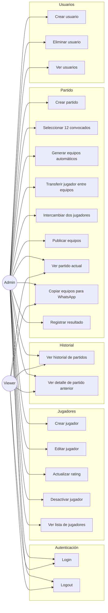
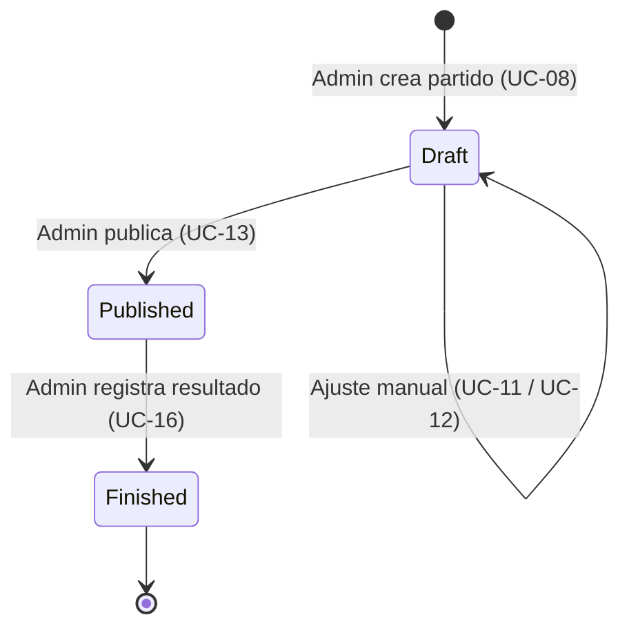
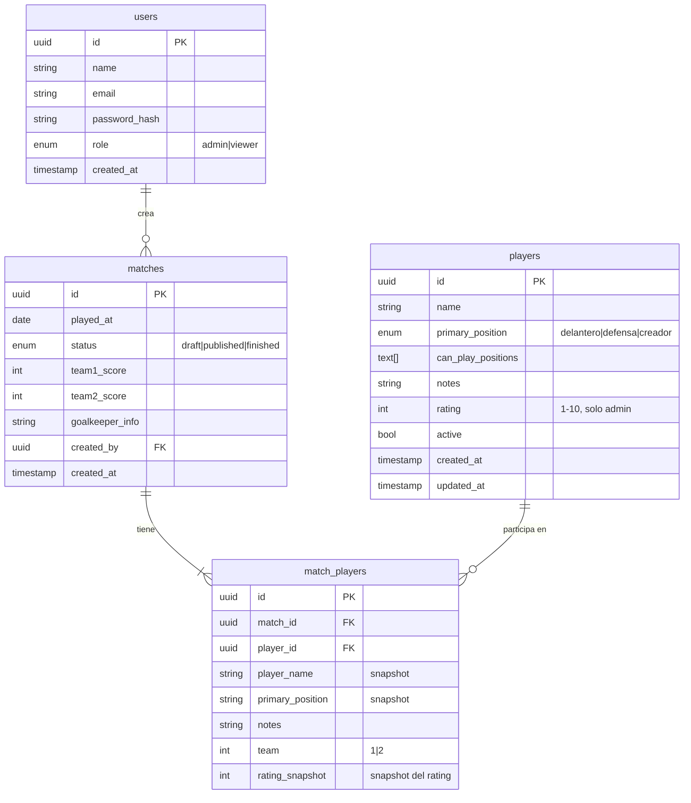

# Casos de Uso — Futbol App

## Actores del sistema

| Actor | Descripción | Permisos |
|---|---|---|
| **Admin** | Organiza el partido, gestiona jugadores y usuarios | Lectura + Escritura total |
| **Viewer** | Miembro del grupo que consulta equipos e historial | Solo lectura |

---

## Mapa de casos de uso



---

## Casos de uso detallados

### UC-01: Login

```
Actor:      Admin o Viewer
Precondición: Usuario registrado en el sistema
Flujo:
  1. Usuario ingresa email y contraseña
  2. Sistema valida credenciales
  3. Sistema emite JWT en cookie HttpOnly (24h)
  4. Redirige al inicio
Flujo alternativo:
  2a. Credenciales inválidas → muestra error genérico
      (no revela si es email o contraseña incorrecta)
```

---

### UC-03: Crear jugador

```
Actor:      Admin
Precondición: Sesión activa con rol admin
Flujo:
  1. Admin completa formulario:
     - Nombre *
     - Posición principal * (delantero | defensa | creador)
     - Posiciones secundarias (checkbox múltiple)
     - Notas (texto libre: "puede subir", "versátil")
     - Rating 1-10 * (solo admin lo ve)
  2. Sistema valida:
     - Nombre no vacío
     - Rating entre 1 y 10
     - Posición válida
  3. Jugador creado y visible en lista
Flujo alternativo:
  2a. Validación falla → muestra error inline
Regla de negocio:
  - El rating es confidencial y NO se muestra a viewers
```

---

### UC-08 a UC-13: Flujo completo del partido



#### UC-09: Seleccionar 12 convocados

```
Actor:      Admin
Precondición: Partido en estado draft
Flujo:
  1. Admin ve lista de jugadores activos
  2. Admin selecciona exactamente 12 (checkbox)
  3. Sistema guarda el snapshot de rating de cada jugador
     (conserva el rating actual para el historial fiel)
  4. Partido actualizado con los 12 convocados
Regla de negocio:
  - Se requieren exactamente 12 jugadores de campo
  - Los arqueros son externos y no se incluyen aquí
```

#### UC-10: Generar equipos automáticos

```
Actor:      Admin
Precondición: 12 jugadores seleccionados
Algoritmo: Greedy Balancing
  1. Ordenar jugadores por rating_snapshot de mayor a menor
  2. Iterar en orden:
     - Si suma_equipo1 <= suma_equipo2 → asignar a equipo 1
     - Si suma_equipo2 < suma_equipo1 → asignar a equipo 2
  3. Resultado: diferencia mínima entre equipos
Ejemplo con datos reales:
  Input:  Yuber(9), Vallejo(9), Florez(9), Hanson(8), Silva(8),
          Yefry(8), Sebas(8), Joseph(8), Ossa(7), CarlosL(7),
          Tancho(7), Mickey(6)
  Total:  94 puntos → ideal 47 vs 47
  Output: Equipo1≈47, Equipo2≈47
```

#### UC-11: Transferir jugador (ajuste manual)

```
Actor:      Admin
Precondición: Equipos generados
Flujo:
  1. Admin ve los dos equipos con botones "→ E2" o "→ E1"
  2. Admin hace clic en el botón de un jugador
  3. HTMX actualiza solo la sección de equipos (sin recargar)
  4. El rating total visible ayuda al admin a ver el balance
Regla de negocio:
  - El admin puede mover jugadores libremente
  - El sistema muestra el total de rating por equipo (solo admin)
```

---

### UC-14 y UC-15: Ver partido y compartir

```
Actor:      Admin o Viewer
Vista pública (sin ratings):
  🔵 Equipo 1
  • Yuber — Defensa (puede subir)
  • Hanson — Delantero
  ...

  🔴 Equipo 2
  • Vallejo — Delantero
  ...

  🧤 Arqueros: Futguardian 1 y Futguardian 2

Botón "Copiar para WhatsApp":
  - Genera texto formateado con asteriscos (negrita en WhatsApp)
  - Copia al portapapeles del dispositivo
  - Muestra confirmación visual
```

---

### UC-17: Historial de partidos

```
Actor:      Admin o Viewer
Muestra por partido:
  - Fecha
  - Estado (draft | published | finished)
  - Equipos (sin ratings para viewers)
  - Resultado si está disponible

Admin además ve:
  - Rating total por equipo (para análisis de balance histórico)
  - El rating_snapshot conserva el rating del jugador en ese día
    (permite analizar si la derrota se relaciona con cambios de nivel)
```

---

## Reglas de negocio centrales

| Regla | Descripción |
|---|---|
| **Rating confidencial** | Solo admins ven el rating. Viewers ven posición y perfil. |
| **Snapshot de rating** | El rating del partido se guarda al momento, no se actualiza retroactivamente. |
| **12 jugadores exactos** | El algoritmo requiere exactamente 12. Los arqueros son externos. |
| **Soft delete** | Los jugadores se desactivan, no se borran. Preserva el historial. |
| **Estado del partido** | draft → published → finished. No se puede retroceder de estado. |
| **Credenciales** | Error genérico en login — no revela si falla email o contraseña. |

---

## Modelo de datos resumido


